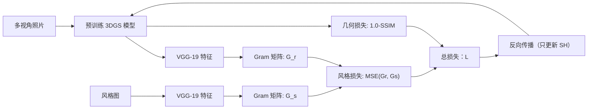
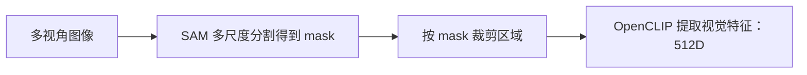
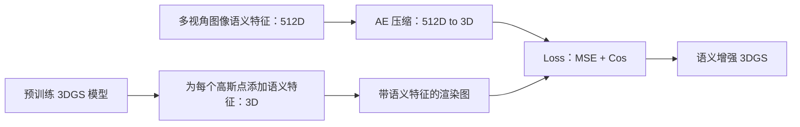
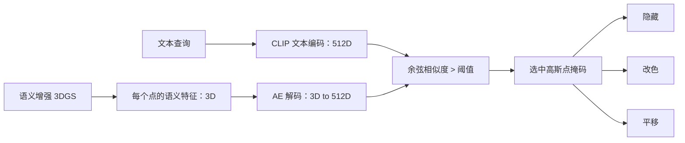

---
# 主题配置
theme: seriph
# 背景图片
background: /3DGS_2.png
# 语法高亮主题
highlighter: shiki
# 是否显示行号
lineNumbers: false
# 幻灯片信息
info: |
  ## 计算机图形学大作业
  基于 3DGS 的场景重建和编辑
  Team Project Presentation
# 绘图功能配置
drawings:
  persist: false
# 默认过渡动画
transition: slide-left
# 标题
title: 基于 3DGS 的场景重建和编辑
---

# 基于 3DGS 的场景重建和编辑
## Scene Reconstruction and Editing based on 3DGS

<div class="pt-12">
  <span @click="$slidev.nav.next" class="px-2 py-1 rounded cursor-pointer hover:bg-white hover:bg-opacity-10">
    按空格键开始 <carbon:arrow-right class="inline"/>
  </span>
</div>

<div class="abs-br m-6 flex gap-2">
  <a href="https://github.com/Staaaaaaaaar/PKU-CG-2025Fall-Project" target="_blank" alt="GitHub"
    class="text-xl slidev-icon-btn opacity-50 !border-none !hover:text-white">
    <carbon-logo-github />
  </a>
</div>


---
layout: section
---

# 什么是高斯泼溅？

---
transition: fade-out
---

# 高斯椭球​​（Gaussian ellipsoids）

3DGS 是一种​​显式的 3D 场景表示方法​​，将场景建模为数十万至数百万个​​可学习的 3D 高斯椭球​

<div>
高斯椭球本质上是一个三维高斯分布：
$$
G(x) = \frac{1}{(2\pi)^{3/2} |\Sigma|^{1/2}} \exp\left(-\frac{1}{2}(x - \mu)^T \Sigma^{-1} (x - \mu)\right)
$$
</div>

<div class="grid grid-cols-2 gap-8 mt-4">
<div class="mt-6">
每个高斯椭球包含以下可学习参数：

* **中心位置：** $\mu \in \mathbb{R}^3$

* **协方差矩阵：** $\Sigma$

* **颜色：** 一组球谐系数 $\{k_l^m\}$

* **不透明度：** $\alpha \in [0, 1]$

</div>
<div class="mt-2">
    
    <a href="https://www.bilibili.com/video/BV1k85NzMEv4/?spm_id_from=333.1387.search.video_card.click&vd_source=697eed77df6bbff463902caad2d804d9" target="_blank" class="text-sm text-blue-500 hover:underline">
      图源：影视飓风 - 把影视飓风变成模型，会怎样？
    </a>
</div>
</div>

---
transition: slide-up
---

# 高斯椭球​​（Gaussian ellipsoids）

使用球谐函数表示视角依赖的外观

<div class="grid grid-cols-2 gap-8 mt-8">
<div>

球谐函数 $Y_l^m(\theta, \phi)$ 构成了一组定义在单位球面上的标准正交基函数。任何定义在球面上的函数都可以用这组基函数的加权和来近似：

$$
c(\theta, \phi) \approx \sum_{l=0}^{L} \sum_{m=-l}^{l} k_l^m Y_l^m(\theta, \phi)
$$

给定一个观察方向 $\bold{v}$，我们可以计算出该方向对应的球面坐标 $(\theta, \phi)$，然后把该方向对应的所有基函数的值与存储的系数做加权求和，就合成出了这个方向应该看到的颜色。
</div>
<div class="mt-6" >
    
</div>
</div>

---
transition: slide-up
---

# 泼溅（Splatting）

将 3D 高斯球渲染成 2D 图像

给定视图变换 $W$ 和射影变换 $P$，可通过以下公式计算投影的二维高斯椭球：

$$
\mu' = P \cdot W \cdot \mu, \quad
\Sigma' = J R \Sigma R^T J^T
$$

其中 $R$ 是旋转矩阵，$J$ 是射影变换的仿射近似的雅可比矩阵。

<div class="">
    
</div>

---
transition: fade-out
---

# 光栅化（Rasterization）

基于切片（Tile-based）的混合光栅化

1.  **预处理与排序:** 
    - 筛选：根据视锥体剔除不可见的高斯点。
    - 分块：将屏幕（例如 $1280 \times 720$）划分为小像素方块（例如 $16 \times 16$）。
    - 实例化：根据高斯点的 2D 范围，将该点“复制”到所有它覆盖的 Tile 列表中。
    - 排序：对每个 Tile 内部的高斯点按深度从近到远进行快速排序。
2.  **块渲染:**
    - 计算贡献度：对于当前像素，遍历该 Tile 列表中的高斯点计算贡献度。
    $$
    G(x,y)=exp\left(-\frac{1}{2}\Delta^T (\Sigma')^{-1} \Delta\right)
    $$
    - 计算影响系数：$\sigma_i = \alpha_i \cdot G(x,y)$

---

# 光栅化（Rasterization）

基于切片（Tile-based）的混合光栅化

3.  **混合：** 像素的最终颜色通过所有高斯点加权合并得到
    $$
    C = \sum_{i\in sorted} c_i\sigma_i \prod_{j=1}^{i-1} (1 - \sigma_j)
    $$
    
    - 早期退出优化：当累计的不透明度接近 $1.0$ 时，忽略后续的、更远的高斯点对该像素颜色的贡献。

4. **后处理：** ……

---
layout: section
---

# 三维场景重建和编辑

---
transition: fade-out
---

# 总流程（Pipeline）

<div class="ma w-150 flex justify-center mb-4">
  
</div>

<div class="grid grid-cols-2 gap-8">

1.  **初始化：**
    - SFM 点云：使用 COLMAP 等工具对多张照片进行特征匹配，生成稀疏的三维点云。
    - 初始化参数：每个初始点被转化为一个 3D 高斯椭球，其属性包括
        - 位置、透明度、球谐系数
        - 协方差：使用旋转 $q$ 和缩放 $s$ 表示
            $$ \Sigma = R S S^T R^T $$


</div>

---
transition: fade-out
---

# 总流程（Pipeline）

<div class="ma w-150 flex justify-center mb-4">
  
</div>

2.  **训练循环：**
    - 投射与渲染：如前所述，将 3D 高斯投影为 2D 椭圆，并利用 Tile-based 光栅化渲染出当前视角下的图像 $I_{render}$。
    - 计算损失：对比渲染图与真实照片 $I_{gt}$，结合**像素级损失**和**结构级损失**
        $$
        \mathcal{L} = (1-\lambda) \cdot L_1 + \lambda \cdot \text{DSSIM}
        $$
    - 反向传播：计算损失函数对每个高斯属性（位置、缩放、旋转、透明度、SH）的梯度。
    - 参数更新：使用优化器更新高斯属性。

---
transition: slide-up
---

# 总流程（Pipeline）

<div class="grid grid-cols-2 gap-8">

<div class="mt-8">

3.  **密度自适应控制：** 3DGS 能够精细刻画细节的核心。


</div>

<div class="flex flex-col gap-3 w-full max-w-70 mx-auto mt-8">
  <div class="text-center border border-green-500/30 bg-green-500/5 p-3 rounded">
    <div class="text-lg font-bold mb-1 text-green-700">Clone</div>
    <div class="text-xs">
      针对 <b>欠重建区域</b><br>
      特征：梯度大，体积小<br>
      <div class="mt-1 text-xs text-gray-500">操作：原地复制一个球</div>
    </div>
  </div>

  <div class="text-center border border-blue-500/30 bg-blue-500/5 p-3 rounded">
    <div class="text-lg font-bold mb-1 text-blue-700">Split</div>
    <div class="text-xs">
      针对 <b>过重建区域</b><br>
      特征：梯度大，体积大<br>
      <div class="mt-1 text-xs text-gray-500">操作：大球分裂为两个小球</div>
    </div>
  </div>

  <div class="text-center border border-red-500/30 bg-red-500/5 p-3 rounded">
    <div class="text-lg font-bold mb-1 text-red-700">Culling</div>
    <div class="text-xs">
      针对 <b>冗余区域</b><br>
      特征：透明度小于阈值<br>
      <div class="mt-1 text-xs text-gray-500">操作：直接删除</div>
    </div>
  </div>
</div>

</div>
---
layout: two-cols
transition: fade-out
---

# 场景风格化（Stylization）

目标效果


1. **几何不变**：场景形状/结构保持
2. **风格迁移**：颜色、纹理、笔触更像目标风格图


::right::

<div class="">
  
  
</div>

---
transition: slide-up
---

# 场景风格化（Stylization）

原理：冻结几何参数，只优化颜色参数



<div class="grid grid-cols-2 gap-6 mt-6">
  <div class="border rounded p-5 bg-gray-500/5">
    <div class="font-bold mb-1">VGG 特征是什么？</div>
    <div class="opacity-80 text-sm" v-markdown>

VGG 特征指的是使用 VGG 神经网络提取的中间层激活值 $F\in\mathbb{R}^{C\times H\times W}$。这些特征表示图像在不同抽象层次的内容信息。

  </div>
  </div>
  <div class="border rounded p-5 bg-gray-500/5">
    <div class="font-bold mb-1">Gram 矩阵为什么代表风格？</div>
    <div class="opacity-80 text-sm" v-markdown>

将 $F$ 展平为 $\tilde{F}\in\mathbb{R}^{C\times HW}$，Gram 矩阵为 $G=\tilde{F}\tilde{F}^T\in\mathbb{R}^{C\times C}$。
它忽略位置，只统计通道相关性，捕获颜色/纹理/笔触“统计特性”。

  </div>
  </div>
</div>

---
transition: fade-out
---

# 场景编辑（Editing）

目标效果

用户通过自然语言描述物体，系统自动定位对应的高斯点，并支持**删除、改色、平移**等编辑操作。


<div class="text-center text-sm text-gray-500 mt-2">
query: the train; action: color; value: 255,0,0
</div>

---
transition: fade-out
---

# 场景编辑（Editing）

1. 离线语义预处理（SAM + CLIP）

<div class="mt-6 mb-6">

</div>

- 基于 SAM 的场景解构：首先，从多个视角捕获的场景图像被输入 SAM。SAM 作为一种强大的通用零样本分割器，能够将每张二维图像无类别预设地分割为一系列边界精准、语义一致的候选区域。这相当于对三维世界在二维投影上进行了初步的、实例化的“解剖”。

- 基于 CLIP 的语义嵌入：随后，每个由 SAM 分割得到的候选区域图像块，被输入 CLIP 模型的图像编码器。CLIP 作为一个在多模态（图像-文本）对比学习中训练的模型，能够将图像内容映射到一个高维的、与文本共享的语义特征空间。至此，每个候选区域被赋予了一个具有丰富语义信息的 512 维特征向量，为后续与任意文本描述的匹配奠定了基础。


---
transition: fade-out
---

# 场景编辑（Editing）

2. 语义特征绑定到 3DGS 模型

<div class="mt-6 mb-6">

</div>

- 语义特征附着与压缩：与为每个三维高斯点定义位置、颜色、透明度等属性类似，为每个高斯点附加一个额外的语义特征属性。
- 可微语义渲染：在训练过程中，当 3DGS 根据视点渲染出二维图像时，系统会同时执行可微的语义特征渲染。
- 优化目标：优化目标是最小化特征图与对应视角的 CLIP GT 语义特征图之间的差异。


---

# 场景编辑（Editing）

3. 文本定位和编辑

<div class="mt-6 mb-6">

</div>

- 查询向量化与相似度检索：将用户输入文本通过 CLIP 转化为特征向量，接着计算余弦相似度选择匹配的目标。
- 基于高斯属性的显式编辑：得益于 3DGS 的显式表示，对检索出的目标高斯点集合进行隐藏、改色或平移操作。


---
layout: section
---

# 项目框架

---

# 代码目录结构

````md magic-move
```bash
.
├── data/                                       # 存放训练数据，包括图像和相机参数
├── docs/                                       # 文档说明
├── output/                                     # 保存训练好的 3D 高斯点云模型和渲染结果
├── scripts/                                    # 数据预处理、训练和渲染脚本
├── src/                                        # 项目核心源代码
│   ├── rendering/                              # 基于 OpenGL 的实时渲染模块
│   └── training/                               # 场景重建和编辑模块
└── third_party/                                # 第三方库
```
```bash
.
├── data/                                     # 存放训练数据，包括图像和相机参数
├── docs/                                     # 文档说明
├── output/                                   # 保存训练好的 3D 高斯点云模型和渲染结果
├── scripts/                                  # 数据预处理、训练和渲染脚本
├── src/                                      # 项目核心源代码
│   ├── rendering/                            # 基于 OpenGL 的实时渲染模块
│   │  ├─ Camera.h                            # 相机参数与控制接口
│   │  ├─ Camera.cpp                          # 相机矩阵与交互实现
│   │  ├─ GaussianPointCloud.h                # 点云数据结构与接口
│   │  ├─ GaussianPointCloud.cpp              # PLY 解析、上传 GPU
│   │  ├─ Renderer.h                          # 渲染主流程接口
│   │  ├─ Renderer.cpp                        # 排序、绘制与状态管理
│   │  ├─ Shader.h                            # Shader 封装接口
│   │  ├─ Shader.cpp                          # Shader 编译/链接/Uniform
│   │  ├─ main.cpp                            # 程序入口与渲染循环
│   │  ├─ CMakeLists.txt                      # 渲染模块构建配置
│   │  ├─ utils/                              # 工具函数
│   │  └─ shaders/                            # 着色器代码
│   └── training/                             # 场景重建和编辑模块
└─ third_party/                               # 第三方库
```
```bash
.
├── data/                                     # 存放训练数据，包括图像和相机参数
├── docs/                                     # 文档说明
├── output/                                   # 保存训练好的 3D 高斯点云模型和渲染结果
├── scripts/                                  # 数据预处理、训练和渲染脚本
├── src/                                      # 项目核心源代码
│   ├── rendering/                            # 基于 OpenGL 的实时渲染模块
│   └── training/                             # 场景重建和编辑模块
│       ├──arguments/                         # 参数封装、控制
│       ├──edit/                              # 场景编辑
│       ├──gaussian_renderer/                 # 可微渲染器
│       ├──scene/                             # 高斯场景封装、数据读取
│       ├──style/                             # 场景风格化
│       ├──submodules/                        # 子模块
│       └──utils/                             # 相机、图像、损失等辅助函数
└── third_party/                              # 第三方库
```
````

<div class="abs-br m-6 flex gap-2">
  <a href="https://github.com/Staaaaaaaaar/PKU-CG-2025Fall-Project" target="_blank" alt="GitHub"
    class="text-xl slidev-icon-btn opacity-50 !border-none !hover:text-white">
    <carbon-logo-github />
  </a>
</div>

---
layout: section
---

# 代码展示

---
transition: slide-up
---

# 高斯泼溅

````md magic-move
```glsl
// src/rendering/shaders/splat.vert

// 由四元数构造旋转矩阵列向量
vec3 col0 = vec3(1.0 - 2.0 * (yy + zz), 2.0 * (xy + wz), 2.0 * (xz - wy));
vec3 col1 = vec3(2.0 * (xy - wz), 1.0 - 2.0 * (xx + zz), 2.0 * (yz + wx));
vec3 col2 = vec3(2.0 * (xz + wy), 2.0 * (yz - wx), 1.0 - 2.0 * (xx + yy));

// 计算 3D 协方差
vec3 axis0 = col0 * aScale.x;
vec3 axis1 = col1 * aScale.y;
vec3 axis2 = col2 * aScale.z;

mat3 A = mat3(axis0, axis1, axis2);
mat3 cov3 = A * transpose(A);
```
```glsl
// src/rendering/shaders/splat.vert

// 计算雅可比矩阵
float jsx = (SX * WIDTH) / (2.0 * tz);
float jsy = (SY * HEIGHT) / (2.0 * tz);
float jtx = (SX * t.x * WIDTH) / (2.0 * tz2);
float jty = (SY * t.y * HEIGHT) / (2.0 * tz2);
float jtz = ((zFar - zNear) * WZ) / (2.0 * tz2);

mat3 J = mat3(
    jsx, 0.0, 0.0,
    0.0, jsy, 0.0,
    jtx, jty, jtz
);

// 计算 2D 协方差
mat3 W = mat3(view);
mat3 JW = J * W;
mat3 V_prime = (JW * cov3) * transpose(JW);

float cov00 = V_prime[0][0];
float cov01 = V_prime[0][1];
float cov11 = V_prime[1][1];
```
```glsl
// src/rendering/shaders/splat.vert

// SH 颜色（3x16）
float Y[16];
EvalSH16(worldDir, Y);
int base = int(gl_VertexID) * 48;
vec3 col = vec3(0.0);
for (int c = 0; c < 3; ++c)
{
    float sum = 0.0;
    int offset = base + c * 16;
    for (int k = 0; k < 16; ++k)
        sum += texelFetch(shCoeffsTex, offset + k).r * Y[k];
    col[c] = sum;
}
col = vec3(0.5) + col;
```
````


---
layout: default
transition: slide-up
---

# 自适应密度控制

```python{*|10|14|15|17-27}{maxHeight: '420px'}
class GaussianModel:
    def densify_and_prune(self, 
                          max_grad,     #最大梯度阈值
                          min_opacity,  #最小不透明度阈值
                          extent,       #场景范围
                          max_screen_size,  #最大屏幕半径
                          radii         #所有高斯球的2D投影半径
                          ):
        '''密化和剪枝'''
        grads = self.xyz_gradient_accum / self.denom    #平均梯度
        grads[grads.isnan()] = 0.0      #未被渲染的球

        self.tmp_radii = radii      #临时存储
        self.densify_and_clone(grads, max_grad, extent)     #复制
        self.densify_and_split(grads, max_grad, extent)     #分裂

        #不透明度剪枝
        prune_mask = (self.opacity_activation(self.opacity) < min_opacity).squeeze()
        
        if max_screen_size:
            #屏幕空间尺寸剪枝
            big_points_vs = self.max_radii2D > max_screen_size
            #世界空间尺寸剪枝
            big_points_ws = self.scaling_activation(self.scaling).max(dim=1).values > 0.1 * extent
            #剪枝条件合并
            prune_mask = torch.logical_or(torch.logical_or(prune_mask, big_points_vs), big_points_ws)
        self.prune_points(prune_mask)

        #清理内存
        tmp_radii = self.tmp_radii
        self.tmp_radii = None

        torch.cuda.empty_cache()
```

---
layout: default
transition: slide-up
---

# VGG 特征提取

```python{*|10-11|20-37|39-41}{maxHeight: '420px'}
class VGGFeatureExtractor(nn.Module):
    """VGG-19 特征提取器"""
    
    # 风格层
    STYLE_LAYERS = ['relu1_1', 'relu2_1', 'relu3_1', 'relu4_1'] 
    
    def __init__(self):
        super(VGGFeatureExtractor, self).__init__()
        
        # 预训练的VGG19模型
        vgg = vgg19(weights=VGG19_Weights.IMAGENET1K_V1).features
        
        self.model = nn.Sequential()
        i = 1  # block 计数
        j = 1  # layer 计数
        
        # 提取截止的层
        MAX_LAYER = 'relu4_1' 
        
        for layer in vgg.children():
            name = None
            if isinstance(layer, nn.Conv2d):
                name = f'conv{i}_{j}'
            elif isinstance(layer, nn.ReLU):
                name = f'relu{i}_{j}'
                layer = nn.ReLU(inplace=False)
                j += 1
            elif isinstance(layer, nn.MaxPool2d):
                name = f'pool{i}'
                i += 1
                j = 1  # 进入下一个 block，重置层计数
            
            if name:
                self.model.add_module(name, layer)
            
            if name == MAX_LAYER:
                break
        
        # 冻结参数
        for param in self.parameters():
            param.requires_grad = False
        self.eval()

```

---
layout: default
transition: slide-left
---

# Autoencoder

```python{*|10-20|22-29}{maxHeight: '420px'}
class CLIPCompressor(nn.Module):
    """CLIP 特征压缩器"""
    def __init__(
        self,
        encoder_dims=(256, 128, 64, 32, 3), # 编码器层级维度
        decoder_dims=(32, 64, 128, 256, 512), # 解码器层级维度
    ):
        super().__init__()

        # 编码器
        enc = []
        in_dim = 512
        for i, d in enumerate(encoder_dims):
            enc.append(nn.Linear(in_dim, d))
            # BatchNorm, ReLU 
            if i < len(encoder_dims) - 1:
                enc.append(nn.BatchNorm1d(d))
                enc.append(nn.ReLU(inplace=True))
            in_dim = d
        self.encoder = nn.Sequential(*enc)

        # 解码器
        dec = []
        for i, d in enumerate(decoder_dims):
            dec.append(nn.Linear(in_dim, d))
            if i < len(decoder_dims) - 1:
                dec.append(nn.ReLU(inplace=True))
            in_dim = d
        self.decoder = nn.Sequential(*dec)
```


---
layout: section
---

# 总结

---
transition: fade-out
---

# DEMO
三维场景重建 + 3DGS 实时渲染的 OpenGL 实现

<div class="grid grid-cols-2 gap-8 mt-10">
  
  
</div>

---
transition: fade-out
---

# DEMO
风格化三维场景重建

---
transition: slide-up
---

# DEMO
场景编辑
<div class="text-center">
query: "the train", action: "color", value: "[255, 0, 0]"
</div>
<div class="mt-6">
  
</div>

---
layout: default
class: "text-left"
---

# 展望

<div class="text-sm grid grid-cols-2 gap-8 mt-4">
<div>

#### 不足与挑战

<div class="mt-4">

* **存储压力与显存限制**：原始 3DGS 包含数百万个高斯基元，动辄数百 MB 的体积给**移动端部署**和网络传输带来极大挑战。
* **物理仿真**：缺乏显式网格结构，导致**碰撞检测、布料模拟**等物理交互难以直接进行。
* **重光照困难**：颜色信息耦合在球谐函数中，难以像传统渲染那样分离出材质、法线与环境光。
* **动态一致性**：场景建模在处理剧烈运动或大幅拓扑变化时，仍存在计算效率低和重影问题。
* ……

</div>
</div>
<div>

#### 趋势与前沿

<div class="mt-4">

* **轻量化与压缩**：在保持“实时渲染”优势的前提下，将场景体积降低到可以在 5G 甚至 4G 网络下流畅加载的水平。
* **显式表面重构**：将高斯球扁平化，转化为硬质的、带有拓扑结构的**三角网格**，提供可用于物理引擎的精确几何。
* **语义与场景理解**：让每个高斯球具备**语义标签**，支持物体级编辑、删除与场景重组。
* **生成式 AIGC**：结合扩散模型，通过文字或单张图片生成高质量的 3DGS 资产。
* **4DGS 技术**：在一个“标准帧”上学习**变形场**，实现时间上的连续建模与渲染；在**四维空间**中定义高斯椭球，渲染时对 4D 椭球进行“时间切片”，得到的 3D 高斯投影，再进行常规渲染。
* ……

</div>
</div>
</div>

---
layout: end
---

# END