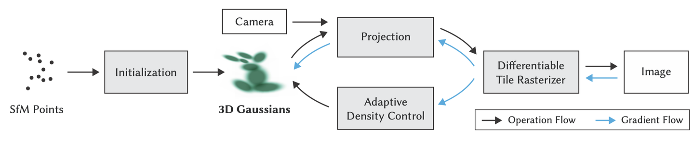
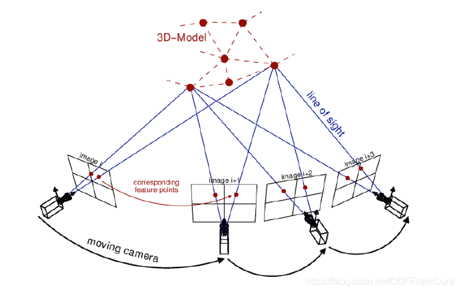
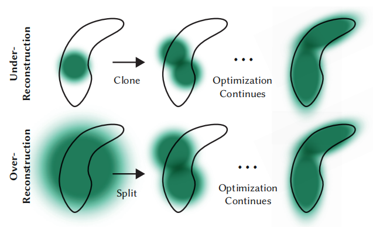

---
# 主题配置
theme: seriph
# 背景图片
background: https://source.unsplash.com/collection/94734566/1920x1080
# 语法高亮主题
highlighter: shiki
# 是否显示行号
lineNumbers: false
# 幻灯片信息
info: |
  ## 计算机图形学大作业
  基于高斯泼溅的三维场景重建
  Team Project Presentation
# 绘图功能配置
drawings:
  persist: false
# 默认过渡动画
transition: slide-left
# 标题
title: 基于高斯泼溅的三维场景重建
---

# 基于高斯泼溅的三维场景重建
## 3D Scene Reconstruction based on Gaussian Splatting

计算机图形学大作业展示

<div class="pt-12">
  <span @click="$slidev.nav.next" class="px-2 py-1 rounded cursor-pointer hover:bg-white hover:bg-opacity-10">
    按空格键开始 <carbon:arrow-right class="inline"/>
  </span>
</div>

<div class="abs-br m-6 flex gap-2">
  <a href="https://github.com/your-repo-link" target="_blank" alt="GitHub"
    class="text-xl slidev-icon-btn opacity-50 !border-none !hover:text-white">
    <carbon-logo-github />
  </a>
</div>

---
layout: section
---

# 什么是高斯泼溅？

---
transition: fade-out
---

# 高斯椭球​​（Gaussian ellipsoids）

3DGS 是一种​​显式的 3D 场景表示方法​​，将场景建模为数十万至数百万个​​可学习的 3D 高斯椭球​

<div>
高斯椭球本质上是一个三维高斯分布：
$$
G(x) = \frac{1}{(2\pi)^{3/2} |\Sigma|^{1/2}} \exp\left(-\frac{1}{2}(x - \mu)^T \Sigma^{-1} (x - \mu)\right)
$$
</div>

<div class="grid grid-cols-2 gap-8 mt-4">
<div>
每个高斯椭球包含以下可学习参数：

* **中心位置：** $\mu \in \mathbb{R}^3$

* **协方差矩阵：** $\Sigma$

* **颜色：** 一组球谐系数 $\{k_l^m\}$

* **不透明度：** $\alpha \in [0, 1]$

</div>
<div class="mt-4">
    <div class="flex items-center justify-center h-48 bg-gray-200 rounded text-gray-500">
        [示意图：由无数小椭球组成的3D物体]
    </div>
    <div class="mt-2 text-sm text-gray-500 text-center">
        图示：显式高斯球表示 vs 隐式神经网络
    </div>
</div>
</div>

---
transition: slide-up
---

# 高斯椭球​​（Gaussian ellipsoids）

使用球谐函数表示视角依赖的外观

<div class="grid grid-cols-2 gap-8 mt-8">
<div>

球谐函数 $Y_l^m(\theta, \phi)$ 构成了一组定义在单位球面上的标准正交基函数。任何定义在球面上的函数都可以用这组基函数的加权和来近似：

$$
c(\theta, \phi) \approx \sum_{l=0}^{L} \sum_{m=-l}^{l} k_l^m Y_l^m(\theta, \phi)
$$

给定一个观察方向 $\bold{v}$，我们可以计算出该方向对应的球面坐标 $(\theta, \phi)$，然后把该方向对应的所有基函数的值与存储的系数做加权求和，就合成出了这个方向应该看到的颜色。
</div>
<div class="mt-6" >
    <div class="flex items-center justify-center h-48 bg-gray-200 rounded text-gray-500">
        [示意图：球谐函数的可视化]
    </div>
    <div class="mt-2 text-sm text-gray-500 text-center">
        图示：不同阶数的球谐函数
    </div>
</div>
</div>

---
transition: slide-up
---

# 泼溅（Splatting）

将 3D 高斯球渲染成 2D 图像

给定视图变换 $W$ 和射影变换 $P$，可通过以下公式计算投影的二维高斯椭球：

$$
\mu' = P \cdot W \cdot \mu, \quad
\Sigma' = J R \Sigma R^T J^T
$$

其中 $R$ 是旋转矩阵，$J$ 是射影变换的仿射近似的雅可比矩阵。

<div class="">
    <div class="flex items-center justify-center ma w-100 h-50 bg-gray-100 rounded text-gray-400 border-2 border-dashed">
        [示意图：高斯泼溅]
    </div>
</div>

---
transition: fade-out
---

# 光栅化（Rasterization）

基于切片（Tile-based）的混合光栅化

1.  **预处理与排序:** 
    - 筛选：根据视锥体剔除不可见的高斯点。
    - 分块：将屏幕（例如 $1280 \times 720$）划分为小像素方块（例如 $16 \times 16$）。
    - 实例化：根据高斯点的 2D 范围，将该点“复制”到所有它覆盖的 Tile 列表中。
    - 排序：对每个 Tile 内部的高斯点按深度从近到远进行快速排序。
2.  **块渲染:**
    - 计算贡献度：对于当前像素，遍历该 Tile 列表中的高斯点计算贡献度。
    $$
    G(x,y)=exp\left(-\frac{1}{2}\Delta^T (\Sigma')^{-1} \Delta\right)
    $$
    - 计算影响系数：$\sigma_i = \alpha_i \cdot G(x,y)$

---

# 光栅化（Rasterization）

基于切片（Tile-based）的混合光栅化

3.  **混合：** 像素的最终颜色通过所有高斯点加权合并得到
    $$
    C = \sum_{i\in sorted} c_i\sigma_i \prod_{j=1}^{i-1} (1 - \sigma_j)
    $$
    
    - 早期退出优化：当累计的不透明度接近 $1.0$ 时，忽略后续的、更远的高斯点对该像素颜色的贡献。

4. **后处理：** ……

---
layout: section
---

# 三维场景重建

---
transition: fade-out
---

# 总流程（Pipeline）

<div class="ma w-150 flex justify-center mb-4">
  
</div>

<div class="grid grid-cols-2 gap-8">

1.  **初始化：**
    - SFM 点云：使用 COLMAP 等工具对多张照片进行特征匹配，生成稀疏的三维点云。
    - 初始化参数：每个初始点被转化为一个 3D 高斯椭球，其属性包括
        - 位置
        - 协方差
        - 透明度
        - 球谐系数



</div>

---
transition: fade-out
---

# 总流程（Pipeline）

<div class="ma w-150 flex justify-center mb-4">
  
</div>

2.  **训练循环：**
    - 投射与渲染：如前所述，将 3D 高斯投影为 2D 椭圆，并利用 Tile-based 光栅化渲染出当前视角下的图像 $I_{render}$。
    - 计算损失：对比渲染图与真实照片 $I_{gt}$，结合**像素级损失**和**结构级损失**
        $$
        \mathcal{L} = (1-\lambda) \| I_{render} - I_{gt} \|^2 + \lambda SSIM(I_{render}, I_{gt})
        $$
    - 反向传播：计算损失函数对每个高斯属性（位置、缩放、旋转、透明度、SH）的梯度。
    - 参数更新：使用优化器更新高斯属性。

---

# 总流程（Pipeline）

<div class="grid grid-cols-2 gap-8">

<div class="mt-8">

3.  **密度自适应控制：** 3DGS 能够精细刻画细节的核心。



</div>

<div class="flex flex-col gap-3 w-full max-w-70 mx-auto mt-4">
  <div class="text-center border border-green-500/30 bg-green-500/5 p-3 rounded">
    <div class="text-lg font-bold mb-1 text-green-700">Clone</div>
    <div class="text-xs">
      针对 <b>欠重建区域</b><br>
      特征：梯度大，体积小<br>
      <div class="mt-1 text-xs text-gray-500">操作：原地复制一个球</div>
    </div>
  </div>

  <div class="text-center border border-blue-500/30 bg-blue-500/5 p-3 rounded">
    <div class="text-lg font-bold mb-1 text-blue-700">Split</div>
    <div class="text-xs">
      针对 <b>过重建区域</b><br>
      特征：梯度大，体积大<br>
      <div class="mt-1 text-xs text-gray-500">操作：大球分裂为两个小球</div>
    </div>
  </div>

  <div class="text-center border border-red-500/30 bg-red-500/5 p-3 rounded">
    <div class="text-lg font-bold mb-1 text-red-700">Culling</div>
    <div class="text-xs">
      针对 <b>冗余区域</b><br>
      特征：透明度小于阈值<br>
      <div class="mt-1 text-xs text-gray-500">操作：直接删除</div>
    </div>
  </div>
</div>

</div>

---
layout: section
---

# 项目框架

---
layout: two-cols
---

# 代码目录结构

```bash
MyProject/
├── assets/          # 原始图像数据
├── output/          # 模型输出与日志
├── scene/           # 场景管理模块
│   ├── dataset.py   # 读取 Colmap 数据
│   └── gaussian.py  # 高斯模型类(核心)
├── gaussian_renderer/ 
│   └── __init__.py  # 渲染器入口
├── train.py         # 训练主脚本
└── utils/           # 通用工具
```

::right::

<div class="mt-14 ml-8">

模块功能解析

<v-clicks>

- Dataset Loader:

解析 cameras.txt, images.txt, points3D.txt。

将相机外参转换为世界坐标系矩阵。

Gaussian Model (gaussian.py):

维护所有可学习参数 (_xyz, _features_dc, _opacity, _scaling, _rotation)。

封装了 densify_and_prune (密度控制) 逻辑。

Renderer:

调用 diff-gaussian-rasterization (C++/CUDA)。

实现可微光栅化，支持反向传播。

</v-clicks>
</div>

---
layout: section
---

# 关键代码展示

---
layout: section
---

# Demo

---
layout: section
---

# 总结和展望---
layout: section
---

# Demo